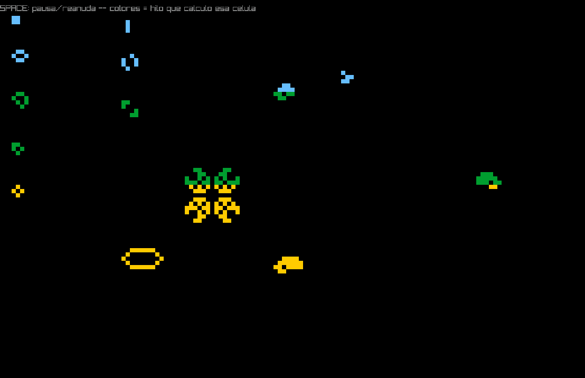

# Conway's Game of Life — Zig + raylib

Implementación del Juego de la Vida de Conway usando únicamente `point()`
y `get_color()` sobre un framebuffer propio (140×90 celdas), escalado a una
ventana de 1120×720. Sigue la misma estructura de proyecto que
`polygon_fill/` (Zig + raylib vía el package manager de Zig).

## Qué incluye

- **`point(fb, x, y, color)`** y **`get_color(fb, x, y)`**: únicas
  funciones que tocan el arreglo de píxeles del framebuffer lógico.
- Algoritmo completo de Conway (underpopulation / survival /
  overpopulation / reproduction) con **orillas tipo toroide**
  (wrap-around): una nave que sale por la derecha reaparece por la
  izquierda.
- **Paralelización real** (extra de la consigna): el cálculo de cada
  generación se reparte en 4 hilos (`std.Thread`) por bandas horizontales;
  cada hilo pinta las células que calculó con un color distinto
  (celeste / verde / dorado / violeta) para que se note visualmente.
- **14 organismos** de la clasificación clásica, cada uno en su propia
  función y verificados por simulación antes de escribir el código
  (incluyendo MWSS y HWSS, cuyas coordenadas exactas se extrajeron
  simulando las recetas de síntesis oficiales de LifeWiki):
  - Still lifes: Block, Beehive, Loaf, Boat, Tub
  - Osciladores: Blinker, Toad, Beacon, Pulsar (p3), Pentadecathlon (p15)
  - Naves: Glider, LWSS, MWSS, HWSS

## Compilar y correr

```bash
cd game_of_life
zig build run
```

Requiere Zig 0.14+ (probado con 0.16) y, en Linux, las librerías de
desarrollo de OpenGL/X11 que raylib necesita:

```bash
sudo apt install libgl1-mesa-dev libx11-dev libxrandr-dev libxinerama-dev libxi-dev libxcursor-dev
```

La primera compilación descarga y compila raylib desde código fuente
(puede tardar uno o dos minutos); las siguientes son instantáneas gracias
al cache de Zig.

**Controles:** `SPACE` pausa/reanuda la simulación, `ESC` o cerrar la
ventana termina el programa.

